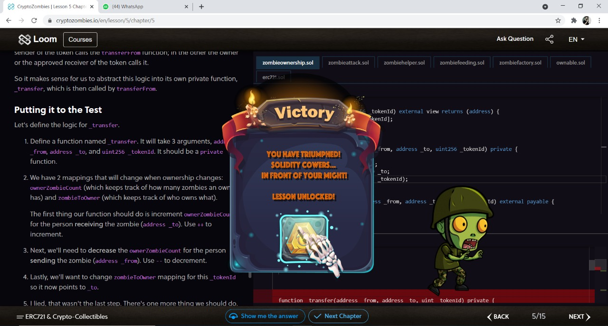

# Lesson-Wise Notes from the [CryptoZombies course](https://cryptozombies.io/):

<br/>
<br/>


<br/>
<br/>

# Navigation:
1. [Lesson 1](https://github.com/hinduBale/cryptoZombiesNFT/tree/master#lesson-1)
2. [Lesson 2](https://github.com/hinduBale/cryptoZombiesNFT/tree/master#lesson-2)
3. [Lesson 3](https://github.com/hinduBale/cryptoZombiesNFT/tree/master#lesson-3)
4. [Lesson 4](https://github.com/hinduBale/cryptoZombiesNFT/tree/master#lesson-4)
5. [Lesson 5](https://github.com/hinduBale/cryptoZombiesNFT/tree/master#lesson-5)

## [Lesson 1](https://share.cryptozombies.io/en/lesson/1/share/saxenismgmail.com):
1. Solidity code is encapsulated in contracts. A contract is the fundamental building block of Ethereum
applications. All variables and functions belong to a contract and this will be the starting point of all projects
2. State Variables:
    Permanently stored in contract storage (they are written to the Ethereum Blockchain)
    Think of declaring state variables like writing to a DB
3. Arithmetic operations:
    x+y, x-y, x*y, x/y, x%y, x**y(same as x^y)
4. structs
    ```
    struct Person {
        uint age;
        string name;
    }
    ```
5. Arrays {Possible to create an array of structs as well as native data types}
    Fixed arrays -> uint [2] fixedArr
    Dynamic arrays -> uint [] dynamicArr
    If an array is declared as public, other contracts can read from but not write to this array
6. ```
    function createZombies (string memory _name, uint _dna) public {
        underscore is a naming convention to separate the private variables from the global variables(_name) 
    } 
    ```
    Notice the word memory along with the string parameter, it signifies that _name would be memory and not in stack, therefore would not be written to the blockchain, hence cheaper
    The *memory* keyword is required for reference type varialbles: arrays, structs, mapping, strings, etc.
7.  Pushing to the array:
    ```
    Person Satoshi = Person(172, "Satoshi");
    people.push(Satoshi);
    ```
8. In solidity, all functions are public by default. Good practice is to intially make all the functions private and then only make public the functions you want to expost to the world
    Convetion to start private functions with underscore (function _generateZombieID())
9. Return values
    ```
    function sayHello() public returns (string memory) {
    }
    ```
    If a function does not change any values, we can term it as a view function. [function sayHello() public view returns (string memory) {}]
    Pure functions => not accessing any data from the contract.
10. Keccak256 and typecasting:
    Ethereum has the hash function keccak 256 built-in, which is a version of SHA3.
    keccak256 expects a single parameter of type bytes
    This means we have to "pack" any parameter before calling keccak256
11. Compiler supports typecasting
    var = uint8(var) => This shit
12. Events are a way for your contract to communicate to your app front-end that something has happened on the blockchain, which can be listening for certain events and take actions when they happen
    Example declaration:
    ```
    event IntegersAdded(uint x, uint y, uint result); //Include input and ouputs to a function
    function add(uint _x, uint _y) public returns (uint) {
        uint result = _x + _y;
        emit IntegersAdded(_x, _y, result);
        return result;
    }
    ```
    
  
<br/>
<br/>

## [Lesson 2](https://share.cryptozombies.io/en/lesson/2/share/saxenismgmail.com):

1. Addresses:
    The ethereum blockchain is made up of accounts, which you can think of as bank accounts.
    An account has a balance of Ether, and you can send and recieve Ether payments to other accounts, just like your bank account can wire transfer money to other bank accounts
    Each bank account has an address which you can think of like a bank account number.Its a unique identifier that points to an account.
    An address is owned by a specific user or a smart contract.
   Mapping:
    So we can use it as a unique ID for ownership of our zombies. When a user creates new zombies by interacting with our app, we'll set ownership of those zombies
    to the Ethereum address that called the function
    A mapping is essentially a key-value store for storing and looking up data
        mapping(uint => string) userIdToName;
2. msg.sender
    In solidity, there are certain global variables that are available to all functions. One of them is msg.sender
    msg.sender refers to the address of the person (or the smart contract) who called the current function
    In solidity, function execution always needs to start with an external caller. A contract will just sit on the blockchain doing nothing until someone calls one of its functions. So, 
    there will always be a msg.sender
3. require is a keyword in Solidity used for condition checking. If this condition is met, then only a function is executed otherwise, it terminates with an error.
    Example:
    ```
    function sayHiToVitalik (string memory _name) public returns (string memory) {
        require(keccak256(abi.encodePacked(_name)) == keccak256(abi.encodePacked("Vitalik")));
        return "Hi Vitalik, thank you for Ethereum!!";
    }
    ```
4. Solidity does not support string comparison natively, so we simply compare the keccak256 hashes of the two strings.
5. Solidity supports inheritence. Hence, instead of writing one big long contract, it makes sense to split your code logic across multiple
    contracts to organize the code.
6.  Really cool and succint inheritence syntax:
    ```
    contract cat is animal {
    } // Here the contract cat inherits from the contract animal :D
    ```
7. Syntax to import one file into another:
    ```
    import './someOtherContract.sol';
    contract newContract is someOtherContract {
    }
    ```
8. In solidity, there are two locations in which you can store variables - in *storage* and in *memory*.
    Storage refers to variables permanently stored on the blockchain.
    Memory variables are temporary, and are erased between external function calls to your contract.
    Think of it like a computer's Hard Disk vs RAM
Example:
 ```
contract SandwichFactory {
    struct Sandwich {
        string name;
        string status;
    }
    Sandwich[] sandwiches;
    function eatSandwich(uint _index) public {
        // Sandwich mySandwich = sandwiches[_index];
        // ^ Seems pretty straightforward, but solidity will give you a warning
        // telling you that you should explicitly declare storage or memory here.
        // So instead, you should declare with the storage keyword, like:
        Sandwich storage mySandwich = sandwiches[_index];
        // ...in which case mySandwich is a pointer to sandwiches[_index]
        // in storage, and...
        mySandwich.status = "Eaten!";
        // ...this will permanently change `sandwiches[_index]` on the blockchain.
        // If you just want a copy, you can use memory:
        Sandwich memory anotherSandwich = sandwiches[_index + 1];
        // ...in which case anotherSandwich will simply be a copy of the 
        // data in memory, and...
        anotherSandwich.status = "Eaten!";
        // ...will just modify the temporary variable and have no effect 
        // on sandwiches[_index + 1]. But you can do this:
        sandwiches[_index + 1] = anotherSandwich;
        // ...if you want to copy the changes back into blockchain storage.
    }
  }
```

9. For a struct People such as:
    ```
    struct People {
        string name;
        uint age;
    }
    People randomMan = People("Sam", "22");
    ```
    You can access the properties of this struct as follows:
    randomMan.age or randomMan.name
10. Types of functions in solidity:
    a. Private
    b. Internal
    c. Public
    d. External
internal is the same as private, except that it's also accessible to contracts that inherit from this contract.
external is the same public, except that these functions can ONLY be called outside the contract.
11. Interacting with other smart contracts on the Ethereum blockchain:
    a. Define an interface (almost the same syntax as that of a contract, but only function signatures are mentioned here.)
    b. Only those function signatures need to be written in the interface, that we actually need to call
    c. Grab the address of the smart contract, you want to call the function from
    d. Initialise the interface you built with this address (much like creating an object)
    e. Example:
    ```
        contract NumberInterface {
            function getNum(address _myAddress) public view returns (uint);
        }
        contract MyContract {
            address NumberInterfaceAddress = 0xabcde122......
            NumberInterface numberContract = NumberInterface(NumberInterfaceAddress);
            function someFunction() public {
                uint num = numberContract.getNum(msg.sender);
            }
        }
      ```
 12. In Solidity you can return more than one value from a function :D
 13. This example illustrates, how we manage multiple return values from Solidity function:
 ```
    function multipleReturns() internal returns(uint a, uint b, uint c) {
        return (1, 2, 3);
    }
        function processMultipleReturns() external {
        uint a;
        uint b;
        uint c;
        // This is how you do multiple assignment:
        (a, b, c) = multipleReturns();
        }
        // Or if we only cared about one of the values:
        function getLastReturnValue() external {
        uint c;
        // We can just leave the other fields blank:
        (,,c) = multipleReturns();
    }
```
<br/>
<br/>

## [Lesson 3](https://share.cryptozombies.io/en/lesson/3/share/saxenismgmail.com):
1. After you deploy a contract to Ethereum, it is immutable. It can never be modified/updated again.
For this reason, if often makes sense to have functions that will allow you to update key portions of your dApp
2. Ownable contract: Owners(contract creators) have special priviliges. It has the following three functions:
    a. When a contract is deployed, its constructor sets the owner to msg.sender (the person who deployed it)
    b. It adds an onlyOwner modifier, which can restirct access to certain functions to only the owner
    c. It allows you to transfer the contract to a new owner
3. Once you inherit from the Ownable contract, you can use the onlyOwner function modifier. This ensures that the function caller is indeed the contract owner or not
4. In Solidity, your users have to pay every time they execute a function on your DApp using a currency called gas. So, basically, users have to spend ETH in order to execute
    functions on your DApp.
5. How much gas is required to execute a function depends on how complex that function's logic is. Each individual operation has a gas cost based roughly on how much 
computing resources will be required to perform that operation. The total gas cost of your function is the sum of the gas costs of all its individual operations.
Therefore, code optimization is much much more important in Ethereum than in other programming languages.
Because, if your code is slopp, then your users are going to pay a premium to execute your functions -- and this could add up to millions of dollars in unnecessary fees across thousand of users.
6. Choosing either of uint8, uint16, uint32, uint256 will result in the same gas fee because Ethereum reserves the same space for each, irrespective of what uint you choose. But you can save on 
    costs when working with multiple uints inside of a struct. Also, for this to happen, you would want to cluster identical data types together (ie put them next to each other in the struct)
7. Solidity provides some native units for dealing with time.
    The variable *now* will return the current unix timestamp of the latest block (the number of seconds that have passed since January 1st 1970).
    Solidity also contains the time units seconds, minutes, hours, days, weeks and years. 
8.  We can pass a storage pointer to a struct as an argument to a private or internal function.
9. An important security practice is to examine all your public and external functions, and try to think of ways users might abuse them. Because, unless these functions have a modifier like onlyOwner,
    any user can call them and pass them any data they want to.
10. The custom function modifier (like onlyOwner) can also take some parameters. The following example will clear things up:
    ```
    mapping (uint => uint) public age;
    // Modifier that requires this user to be older than a certain age:
    modifier olderThan(uint _age, uint _userId) {
    require(age[_userId] >= _age);
    _;
    }
    function driveCar(uint _userId) public olderThan(16, _userId) {
    // Some function logic
    }
    ```
11. Remember how we used memory pointer type along with string in function parameters. Similar to memory we have *calldata* but it's only available to external functions
12. Since view functions only needs to query your local Ethereum node to run the function, it doesn't actually have to create a transaction on the blockchain, which would need to run
    on every single node, and cost gas. Therefore, view functions don't cost any gas when they're called externally by a user.
    Optimize your DApp's gas usage for your users by using read-only external view functions wherever possible.
    If a view function is called internally from another function in the same contract that is not a view function, it will still cost gas. This is because the other function 
    creates a transaction on Ethereum, and will still need to be verified from every node. So view functions are only free when they're called externally.
13. One of the more expensive operations in Solidity is using storage — particularly writes.
    This is because every time you write or change a piece of data, it’s written permanently to the blockchain. Forever! Thousands of nodes across the world need to store that data on
    their hard drives, and this amount of data keeps growing over time as the blockchain grows. So there's a cost to doing that.
    In order to keep costs down, you want to avoid writing data to storage except when absolutely necessary. Sometimes this involves seemingly inefficient programming logic — like
    rebuilding an array in memory every time a function is called instead of simply saving that array in a variable for quick lookups.
    In most programming languages, looping over large data sets is expensive. But in Solidity, this is way cheaper than using storage if it's in an external view function, since 
    view functions don't cost your users any gas. (And gas costs your users real money!).
    An example illustrating how to declare arrays in memory:
    ```
    function getArray() external pure returns(uint[] memory) {
        // Instantiate a new array in memory with a length of 3
        uint[] memory values = new uint[](3);
        // Put some values to it
        values[0] = 1;
        values[1] = 2;
        values[2] = 3;
        return values;
    }
    ```
14. for loops will be preferred over mapping solutions, if it can save gas cost. 

<br/>
<br/>

## [Lesson 4](https://share.cryptozombies.io/en/lesson/4/share/saxenism?id=W251bGwsMiwxNF0=):
1. *view* tells us that by running the functions, no data will be saved/changed.
*pure* tells us that not only does the function not save any data to the blockchain, but it also doens't read any data from the 
blockchain.
Both of these don't cost any gas to call if they're called from outside the contract, but the do cost gas if called internally by another function
because the calling function is eventually making changes on the blockchain.
2. The function modifiers can all be stacked together on a function definition, as follows:
    ```
    function test() external view onlyOwner anotherModifier {
        // Some function-y stuff
    }
   ```
3. The *payable* modifier:
They are a special type of functions that can recieve Ether.
In Ethereum, because both the money (Ether), the data (transaction payload), and the contract code itself all live on Ethereum, it's possible for you to call
a function and pay money to the contract at the same time.
This allows us to have some really cool logic, such as: requiring a certain payment to the contract in order to execute a function. 
Here's an example:
```
contract OnlineStore {
    function buySomething () external payable {
        require(msg.value == 0.01 ether); //ether is an inbuilt uint;
        transferStuff(msg.sender);
    }
}
```
msg.value is a way to see how much Ether was sent to the contract.
If a function is not marked as payable, and you try to send Ether to it, the function will reject your transaction.

4. The payment can only be done to a data type that's called address payable.
    ```
    Example:
    function withdraw() external onlyOwner() {
        address payable _owner = address(uint16(owner()));
        _owner.transfer(address(this).balance);
    }
    address(this).balance will return the total balance stored on the contract.
    ```
    
5. A make-shift way of generating random numbers in Solidity is as follows:
    ```
    // Generate a random number between 1 and 100:
    uint randNonce = 0;
    uint random = uint(keccak256(abi.encodePacked(now, msg.sender, randNonce))) % 100;
    randNonce++;
    uint random2 = uint(keccak256(abi.encodePacked(now, msg.sender, randNonce))) % 100;
    ```
    But, this is unsafe, because technically, this can be hacked. How? Read on:
    In Ethereum, when you call a function on a contract, you broadcast it to a node or nodes on the network 
    as a transaction. The nodes on the network then collect a bunch of transactions, try to be the first to 
    solve a computationally-intensive mathematical problem as a "Proof of Work", and then publish that group 
    of transactions along with their Proof of Work (PoW) as a block to the rest of the network.
    Once a node has solved the PoW, the other nodes stop trying to solve the PoW, verify that the other node's list 
    of transactions are valid, and then accept the block and move on to trying to solve the next block.
    This makes our random number function exploitable.
    Let's say we had a coin flip contract —heads you double your money, tails you lose everything. Let's say it used 
    the above random function to determine heads or tails. (random >= 50 is heads, random < 50 is tails).
    If I were running a node, I could publish a transaction only to my own node and not share it. I could then run the 
    coin flip function to see if I won — and if I lost, choose not to include that transaction in the next block I'm solving. 
    I could keep doing this indefinitely until I finally won the coin flip and solved the next block, and profit.
    
6. One relatively safe method is to use an Oracle to access a random number from outside the Ethereum blockchain

<br/>
<br/>

## [Lesson 5](https://share.cryptozombies.io/en/lesson/5/share/H4XF13LD_MORRIS_💯💯😎💯💯):

1. Tokens on Ethereum:
    A token on Ethereum is basically just a smart contract that follows some common rules — namely it implements
    a standard set of functions that all other token contracts share.
    The token standard that's a much better fit for crypto-collectibles like CryptoZombies — is called ERC721 tokens.
    ERC721 tokens are not interchangeable since each one is assumed to be unique, and are not divisible. You can 
    only trade them in whole units, and each one has a unique ID. 
    using a standard like ERC721 has the benefit that we don't have to implement the auction or escrow logic within our 
    contract that determines how players can trade / sell our zombies. If we conform to the spec, someone else could build
    an exchange platform for crypto-tradable ERC721 assets, and our ERC721 zombies would be usable on that platform. So there
    are clear benefits to using a token standard instead of rolling your own trading logic.
    
2. The contract of ERC721 standard looks pretty much like an interface, waiting to be implemented:
    ```
    contract ERC721 {
    event Transfer(address indexed _from, address indexed _to, uint256 indexed _tokenId);
    event Approval(address indexed _owner, address indexed _approved, uint256 indexed _tokenId);
    function balanceOf(address _owner) external view returns (uint256);
    function ownerOf(uint256 _tokenId) external view returns (address);
    function transferFrom(address _from, address _to, uint256 _tokenId) external payable;
    function approve(address _approved, uint256 _tokenId) external payable;
    }
    ```
    
3. In Solidity, we can inheirt from multiple contracts.

4. To avoid overflows and underflows, we use the SafeMath library. A library is a special type of contract in Solidity. 
One of the things it is useful for is to attach functions to native data types.
For example, with the SafeMath library, we'll use the syntax using SafeMath for uint256. The SafeMath library has 4 functions
 — add, sub, mul, and div. And now we can access these functions from uint256 as follows:
    ```
    using SafeMath for uint256;
    uint256 a = 5;
    uint256 b = a.add(3); // 5 + 3 = 8
    uint256 c = a.mul(2); // 5 * 2 = 10
    ```
    
5. assert is similar to require, where it will throw an error if false. The difference between assert and require is that 
require will refund the user the rest of their gas when a function fails, whereas assert will not. So most of the time you 
want to use require in your code; assert is typically used when something has gone horribly wrong with the code (like a uint overflow).

6. The standard in the Solidity community is to use a format called natspec.

#### Also, thanks for [Loom Network](https://loomx.io/) for bringing such awesome animations to us :D

<br/>
<br/>




